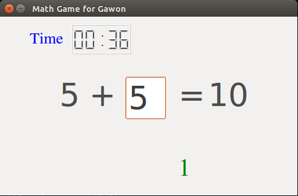

Very simple math game
========================

This game is designed for my daughter.
The problem is to find one digit number to make 10.

Run the code you need `pyside <http://zetcode.com/gui/pysidetutorial/>`_.
Then, you can run the code like this: :: 

    $ python math.py

Having fun!
